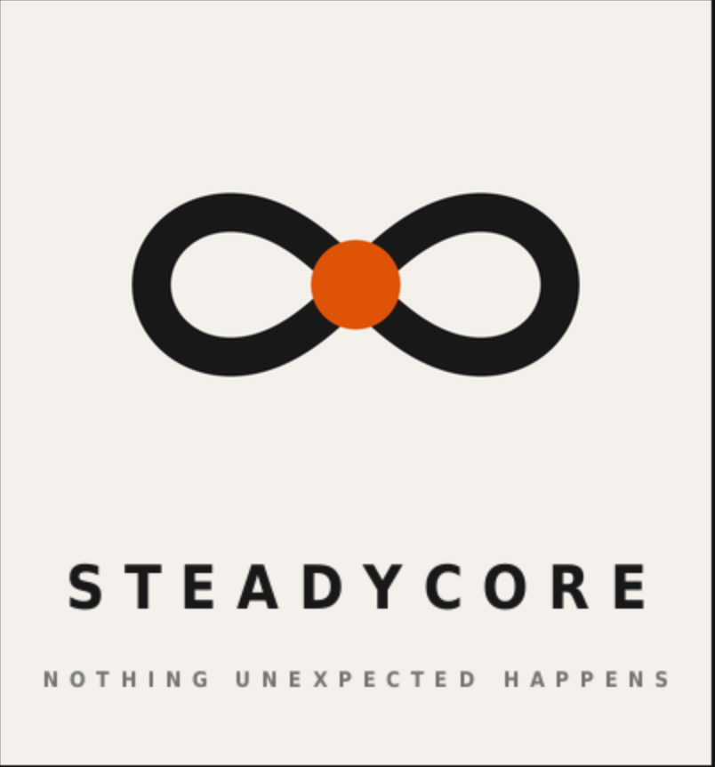

<p align="center">
  
</p>

<h1 align="center">SteadyCore</h1>

<p align="center">Background music where nothing unexpected happens, and the tools to make it.</p>

---

Most focus music is designed to be interesting. This is designed not to be.

No vocals. No build-ups, no drops, no sections. The volume stays the same
from the first second to the last, and the high frequencies are turned
down. Nothing surprises you, because there is nothing left in it that can.

Made for people who find ordinary study music unusable. In Swedish that
group is called NPF. In English it is closest to ADHD, autism and
neurodivergent.

**Listen before you install anything:**

- [45 minutes, calm](https://youtu.be/mZBXpt6Aj1A) — the original, no pulse
- [1 hour 11, darker](https://youtu.be/51qOhEgAMFQ) — lower and heavier
- Bassey NPF — the same rule with a beat, for people who want movement, https://youtu.be/APKtICzeLYs?si=0xshZrWIsGr659JP

---

## Two workflows

Both follow the same rule. They differ in whether there is a pulse.

|  | **Calm** | **Bassey NPF** |
|---|---|---|
| Workflow | `npf-calm-bed.json` | `bassey-npf.json` |
| Sound | Sustained drone, no rhythm | Soft kick, sub bass, sustained chord |
| Tempo | None | 80 to 96 BPM |
| Loop with | `gorloop.sh` | `beatloop.sh` |
| Made for | Reading, sleep, a quiet room | Anyone who finds the drone too still |

The second one exists because of feedback. Adults liked the drone.
Younger listeners wanted something with movement in it. That looks like it
breaks the design until you notice the rule was never "slow". It was that
nothing unexpected happens, and a pulse that never changes is about as
predictable as sound gets. A metronome has never surprised anybody.

See [BASSEY-NPF.md](BASSEY-NPF.md) for how that one was built, which BPM
values work, and what we got wrong first.

---

## What is in here

| File | What it does |
|---|---|
| `npf-calm-bed.json` | The calm ComfyUI workflow. |
| `bassey-npf.json` | The beat workflow. |
| `make_workflow.py` | Rebuilds either JSON if you want to change the prompt or the settings. |
| `gorloop.sh` | Loops a track with no rhythm, by folding its end over its beginning. |
| `beatloop.sh` | Loops a track with a beat, on whole bars, with no crossfade. |
| `RUNBOOK.md` | ComfyUI to a finished YouTube upload, start to finish. |
| `RUNBOOK-beatloop.md` | Driving `beatloop.sh`. |
| `BASSEY-NPF.md` | Why the beat workflow is built the way it is. |
| `logo/` | The mark, as SVG and PNG. |

No audio files. The music lives on YouTube so the repo stays small.

---

## What you need

**ComfyUI** and an ACE-Step model. ComfyUI is the program that actually
makes the music. It is free and it runs on your own computer.

- ComfyUI: https://github.com/comfyanonymous/ComfyUI
- ACE-Step models: https://huggingface.co/Comfy-Org/ACE-Step_1.5_ComfyUI

A graphics card helps a lot but is not required.

**sox** for the looping, and **ffmpeg** for measuring loudness. Neither is
installed by default.

```bash
sudo apt install sox libsox-fmt-all bc ffmpeg
```

`libsox-fmt-all` is easy to miss, and without it sox cannot read FLAC.

That is the whole list.

---

## Making a track

1. Open ComfyUI.
2. Drag the workflow JSON onto the canvas. The whole graph appears.
3. Click the model name in the first box and pick whichever ACE-Step file
   you downloaded. It will not match the filename saved in the workflow.
4. Press Run.
5. The audio lands in your ComfyUI `output` folder.

Then loop it:

```bash
./gorloop.sh bed.flac                                              # calm
./beatloop.sh bed.flac --bpm 96 --offset auto --end auto --min 40  # beat
```

[RUNBOOK.md](RUNBOOK.md) has the whole path through to upload, including
the YouTube settings that quietly matter.

---

## The calm prompt

Written out here so you can read it without opening the JSON. It lives in
`make_workflow.py`, which is where you edit it.

Positive:

    ambient drone, instrumental, no vocals, sustained warm pad, soft felt
    piano, low strings, very slow, no drums, no percussion, no build, no
    drop, no sections, constant dynamics, minimal melody, repetitive,
    warm, dark, soft low pass filter, muted high frequencies, 56 BPM,
    C minor, steady, gentle, patient

Negative:

    vocals, singing, lyrics, choir, drums, percussion, cymbals, hi-hat,
    shaker, bright, harsh, sibilance, crescendo, build up, drop, dynamic
    change, sudden entrance, dramatic, orchestral swell, brass,
    distortion, arpeggio, fast, busy, glitch, reverse

For a darker version, change the tail of the positive prompt to
`dusky, dark, muted high frequencies, 56 BPM, F minor, phrygian mode,
low register, sombre` and drop `warm` and `soft low pass filter`. Naming
the mode does more than moving the key letter around, and `low register`
takes the whole thing down without you having to argue about octaves.

Below about F minor you start losing the fundamental on phone speakers,
which is where most people will actually hear it.

The Bassey NPF prompts are in [BASSEY-NPF.md](BASSEY-NPF.md).

---

## Cover art

YouTube will not accept audio on its own, so every track needs a still
image. These are the prompts behind the three that are up. Square, at
least 1280 across.

The garden is the same in all of them. Only the stones change.

**Calm, dark stones:**

    overhead view of a Japanese dry garden, raked gravel in wide
    concentric rings around two smooth dark stones, warm near-black sand,
    single soft side light, matte surface, no glare, very narrow tonal
    range, deep warm charcoal and pale sand ochre, minimal, still, quiet,
    fine film grain, soft falloff toward the edges, no sky, no horizon,
    no plants, no people

**Darker track, white stones:** the same prompt with `two smooth pale
white stones` in place of the dark ones. The lighter image carries the
heavier music, which was not planned and works anyway.

**Bassey NPF, four stones in a row:**

    overhead view of a Japanese dry garden, four smooth stones in a
    straight row at perfectly even intervals, raked gravel in concentric
    rings around each stone, the rings meeting and overlapping between
    them, warm near-black sand, one stone glowing deep burnt orange,
    single soft side light, matte, narrow tonal range, still, precise,
    fine film grain, no plants, no sky, no people

Four beats in a bar without drawing a drum. The orange is the same one as
the logo, so the third cover looks like it belongs to the other two while
still being the one that stands out.

Negative prompt for all of them:

    bright, high contrast, saturated, vibrant, neon, hdr, busy, cluttered,
    uneven spacing, random placement, plants, sky, horizon, people, faces,
    hands, sharp specular highlights, glare, lens flare, text, watermark,
    logo, drums, instruments, speakers

`uneven spacing, random placement` is what makes the four-stone one work.
Even intervals are the whole idea and an image model will always want to
scatter things naturally.

Two rules that matter more than the wording. Keep the subject centred,
because YouTube Music crops to a square on the lock screen and in
playlists. And check it at 100 pixels wide before you commit, since that
is the size it lives at most of the time. Low contrast detail turns into a
brown smudge.

Dark and flat is deliberate. Someone may have this on screen for an hour.
If it looks striking, it is wrong.

---

## Three things that will cost you an evening

**Lock the seed.** In the KSampler box, change `randomize` to `fixed`
before you start experimenting, not after. Otherwise you get a different
piece every time and the one you liked is gone.

**Keep it under 150 seconds.** Longer and the model loses the thread and
starts adding sections, which is the one thing this music must not do.
Generate short and loop it. A loop cannot surprise you, which is the
entire point.

**Do not touch the negative prompt.** It is doing more work than the
positive one. `crescendo`, `build up`, `drop`, `dynamic change` and
`sudden entrance` are what stop the model from being helpful in the way
that ruins this. Remove them and you get ordinary ambient music that
swells and fades. It might sound nicer. It will not do the job.

Change the prompts in `make_workflow.py` and regenerate the JSON rather
than pasting into ComfyUI. Fewer chances to put the wrong text in the
wrong box, and the prompt you used stays in a file instead of your
clipboard.

---

## What you can change freely

Sampler and scheduler. Steps and CFG. Turbo models want CFG 1.0 and
around 8 to 20 steps; base models want 4.0 and 50 to 70. A beat needs
more steps than a drone does, because a transient is harder to resolve
than a sustained tone.

`shift` in the ModelSamplingAuraFlow node affects the arrangement rather
than the sound. Higher values make the model commit to one structure and
stay there, which is useful here. 3.0 is the default and 5.0 is worth
trying.

And the positive prompt, within reason.

---

## Om NPF, och varför vi gör det här

NPF står för neuropsykiatriska funktionsnedsättningar. Adhd, autism och
det som ligger i närheten. Ingen engelsk förkortning betyder riktigt
samma sak, så resten av det här dokumentet säger adhd och autism i
stället.

Det finns forskning som säger att barn med adhd läser bättre med lugn
bakgrundsmusik, medan jämnåriga utan adhd läser sämre av exakt samma
musik. Samtidigt har en stor del av autistiska personer förhöjd
ljudkänslighet. Har man bägge blir tystnad obehaglig medan oväntat ljud
blir för mycket.

Det låter som en omöjlig kravlista tills man byter ut ett ord. Musiken
ska inte vara lugn. Den ska vara förutsägbar. Då faller resten på plats
av sig själv, och det är därför den här musiken är så tråkig som den är.
Tråkigheten är funktionen.

Vi är en grupp som informerar och hjälper ungdomar med NPF. En diakon är
en av drivkrafterna och har kunskapen. Jag har erfarenheten.

Jag föddes med grunden till multisjukdom och med asperger. Jag var alltid
annorlunda. Datorer förstod jag direkt.

Fyrtio år i teknik senare hör jag saker i ljud som andra inte reagerar
på. Det har mest varit ett besvär. Vanlig pluggmusik byter spår, bygger
upp och släpper, och uppmärksamheten går dit varje gång.

Så jag gjorde något som inte gör det. Efter tjugo minuter fick jag
anstränga mig för att höra att den spelade. Då visste jag att den satt.

Jag har levt ett liv som få har levt. Nu vill jag att det ska bli till
nytta för någon annan.

Verktygen fanns redan. Ingen hade riktat dem hit.

---

## Licence

GPL-3.0. Use it, change it, pass it on. The only condition is that
whatever you build on it stays as free as what you were given.

If you make something with this, tell me and I will link it here.
